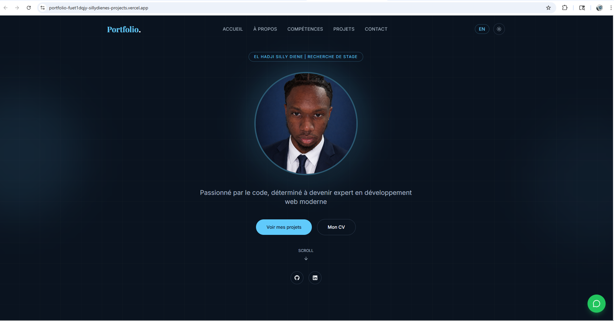
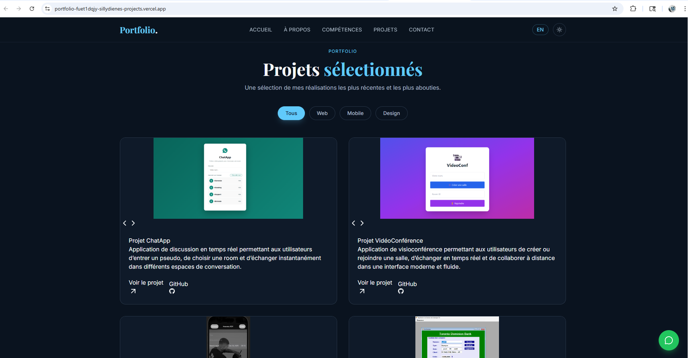
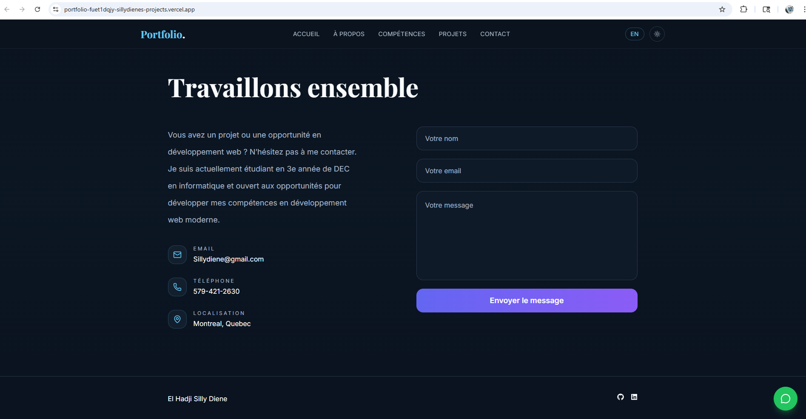
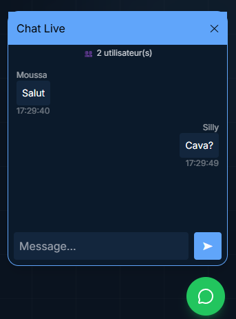

# 🚀 Portfolio Chat App (Real-time)

<p align="center">
  
  
  
  
  
</p>

---

## 🌐 Live Demo

👉 **Portfolio** : https://portfolio-seven-lyart-91.vercel.app  
👉 **Backend API** : https://portfolio-backend-1tr9.onrender.com  
👉 **GitHub** : https://github.com/Sillydiene/portfolio

---

## 📸 Screenshots

### 🎨 Interface Portfolio





### 💬 Chat en temps réel




## ✨ Fonctionalités

*  Chat en temps réel avec Socket.IO
*  Affichage du nombre d’utilisateurs connectés dans LiveChat
*  Formulaire en bas de page avec emailJS
*  Interface moderne responsive
*  Pseudo utilisateur
*  Mise en avant des projets avec lien gitHub et déploiement
*  Communication instantanée client ↔ serveur


---

## 🧱 Tech Stack

### Frontend

* React + Vite
* Tailwind CSS
* Socket.IO Client
* React Hooks

### Backend

* Node.js
* Express
* Socket.IO
* CORS

---

## 📁 Project Structure

```bash
portfolio/
│
├── client/          # Frontend React
├── server/          # Backend Node + Socket.IO
├── screenshots/     # Images README
└── README.md